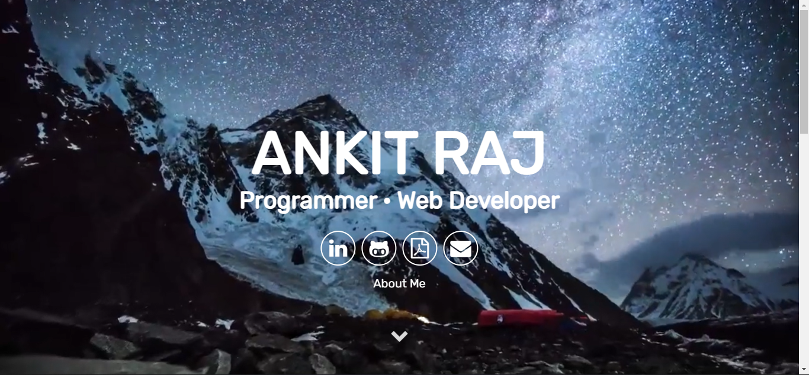

# <a href="https://portfolioankitraj.netlify.app/" target="_blank">Visit My Portfolio Website</a>

 
This website serves as an online portfolio to showcase my web presence, résumé and story

</img>

Please hit me up at ankitraj.ofc@gmail.com if you have any feedback or ideas for the website. Leave a :star: &nbsp;if you like it!
